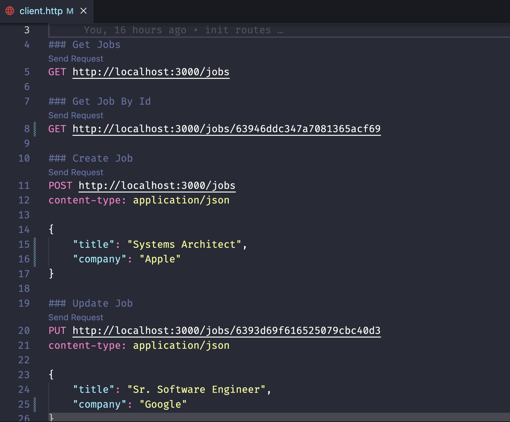

# Jobs API Project

Just a simple CRUD API project with Node.js, Express and MongoDB.

This project aims to provide a minimal API for simulating a Job App, where users can find, create, delete and update jobs opportunities.

## Requirements

- Node.js >= 16.6.0
- npm >= 8.11.0
- Docker

## Available Scripts

In the root directory

- run the following command to init MongoDB

`docker-compose up`

- run the following command to init the Server

`npm i & npm start`

Example using REST Client VSCode extension to test the API routes

